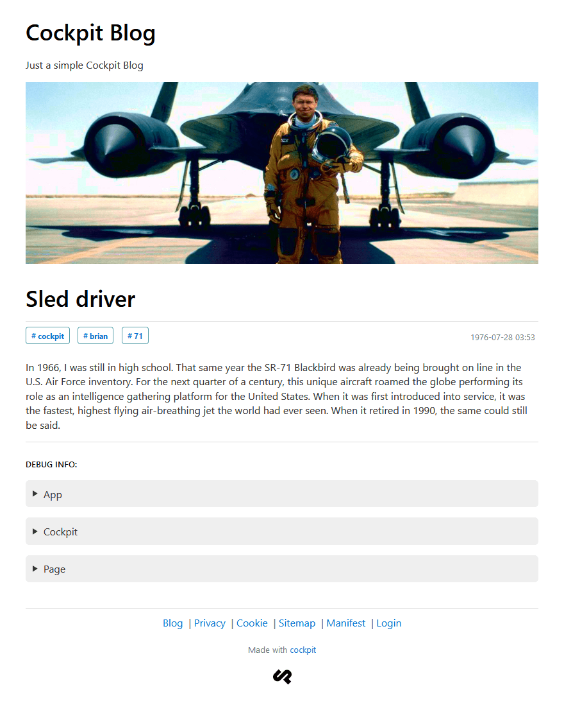

# cockpit-blog

Simple blog implementation with a router

    

---

<blockquote>
    

        <em>Initially based on <a href="https://github.com/Raruto/cockpit-legacy-docs/blob/master/tutorials/simple_blog.md">cockpit-docs/tutorials/simple_blog.md</a></em>
    

</blockquote>

---

### Quickstart:

 1. Download and extract: https://github.com/raruto/cockpit-blog/archive/master.zip
 2. Move it to your localhost server and open: http://localhost/cockpit-blog/install
 3. Your website is now available at: http://localhost/cockpit-blog

## How to develop:

Public stuffs are located at project web root (`_site`, `css`, `js` and `media` folders).

- **Theme:**
    php template files are located in the `_site/_views` folder.

- **Assets:**
    static theme files are located at project web root (`css`, `js`, `media` folders).

- **Router:**
    public site routes are defined in the root **[`index.php`](index.php)** file.

- **Images:**
    uploaded images are located in the `media/uploads` folder.

- **Database:**
    files are located in the `_site/data` folder.

- **Addons:**
    cockpit addons can be placed in the `_site/addons` or `admin/addons` folders (according to your needs).

- **Config:**
    common configuration files are located in the `_site/config` folder, default constants are overridable in through the `_site/defines.php` file.

- **Cockpit:**
    core files are located within the `admin` folder, you can rename it to something less "common" (without pain), but you shouldn't edit any other files inside that folder (unless you know what you're doing).

Open a shell at project web root and run: `php -S localhost:8080 index.php` for starting the built-in development server.

### Cockpit Core:

The following components are shipped by the CMS:

- [MongoDB](https://docs.mongodb.com/manual/reference/) query language
- [UIKit](https://getuikit.com/docs/) + [Riot.js](https://riot.js.org/documentation/) components
- [TinyMCE](https://www.tiny.cloud/docs/) + [Markdown](https://daringfireball.net/projects/markdown/syntax) editor
- [Lime](https://github.com/agentejo/lime) php micro-framework
- [Lexy](https://cpmultiplane.rlj.me/en/docs/lexy) templating engine
- [Rest API](https://getcockpit.com/documentation/api) endpoints
- [PHPMailer](https://github.com/PHPMailer/PHPMailer) forms

**Note:** although cockpit take advantage of the "MongoDB" query language, it doesn't really need a MongoDB server to operate and, unless configured otherwise, it stores all information as json documents within the built-in [SQLite](https://www.sqlite.org/) database located in the [`cockpit/storage/data`](https://github.com/agentejo/cockpit/tree/next/storage/data) folder (see: [MongoHybrid](https://github.com/agentejo/cockpit/tree/next/lib/MongoHybrid), [MongoLite](https://github.com/agentejo/cockpit/tree/next/lib/MongoLite) and [bootstrap.php](https://github.com/agentejo/cockpit/blob/next/bootstrap.php) for further information). Check out the [cockpit-sql-driver](https://github.com/piotr-cz/cockpit-sql-driver) integration if you are planning to use a _MySQL_, _MariaDB_ or _PostgreSQL_ server instance.

### Cockpit Core (Modules):

The following classes are part of the cockpit core:

- [Cockpit](https://github.com/agentejo/cockpit/tree/next/modules/Cockpit)
- [Collections](https://github.com/agentejo/cockpit/tree/next/modules/Collections)
- [Singletons](https://github.com/agentejo/cockpit/tree/next/modules/Singletons)
- [Forms](https://github.com/agentejo/cockpit/tree/next/modules/Forms)

**Note:** take a look at the following [SQL to MongoDB](https://docs.mongodb.com/manual/reference/sql-comparison/) comparison to fully understand the difference between "[collections](https://docs.mongodb.com/manual/core/databases-and-collections/)" and "tables"

### Cockpit Addons:

The following plugins are bundled in this repository:

- [Autosave](_site/addons/Autosave)
- [BetterSlugs](_site/addons/BetterSlugs)
- [Cache](_site/addons/Cache)
- [Debug](_site/addons/Debug)
- [ExtendedForms](_site/addons/ExtendedForms)
- [ExtendedLime](_site/addons/ExtendedLime)
- [ExtendedUI](_site/addons/ExtendedUI)
- [Favicon](_site/addons/Favicon)
- [Honeypot](_site/addons/Honeypot)
- [ImageOptimizer](_site/addons/ImageOptimizer)
- [MaintenanceMode](_site/addons/MaintenanceMode)
- [Matomo](_site/addons/Matomo)
- [NativeLazyLoading](_site/addons/NativeLazyLoading)
- [PWA](_site/addons/PWA)
- [Renderer](_site/addons/Renderer)
- [RSSFeed](_site/addons/RSSFeed)
- [TestAPI](_site/addons/RestAPI)
- [SampleData](_site/addons/SampleData)
- [XMLSitemaps](_site/addons/XMLSitemaps)
- [Snippets](_site/addons/Snippets)

**Note:** take a look at the [Cockpit-Helpers](https://github.com/pauloamgomes/CockpitCMS-Helpers) and [Cockpit-Scripts](https://github.com/raffaelj/cockpit-scripts) repositories to find out some other useful code samples on how to build your own addons (see also: [list-of-cockpit-addons](https://discourse.getcockpit.com/t/list-of-cockpit-addons/234)).

### Translating cockpit (i18n):

Download and copy appropriate language files from:

- [cockpit-i18n](https://github.com/agentejo/cockpit-i18n/) to `/cockpit/config/cockpit/i18n`
- [tinymce-i18n](https://www.tiny.cloud/get-tiny/language-packages/) to `/cockpit/storage/assets/cockpit/i18n/tinymce`

After that you will be able to change the language of Cockpit from the `accounts` panel (admin dashboard).

**Note:** check out the [`i18n`](https://zeraton.gitlab.io/cockpit-docs/guide/basics/configuration.html#i18n-string) and [`languages`](https://zeraton.gitlab.io/cockpit-docs/guide/basics/configuration.html#languages-object-array) directives if you wish to set a default language for all users (see: [zeraton-docs](https://zeraton.gitlab.io/cockpit-docs/guide/basics/configuration.html) to understand how to edit cockpit `config` files)

### Upgrading cockpit (Core):

Backup your `admin/defines.php` file and replace the `admin` folder with your [cockpit-next](https://github.com/agentejo/cockpit/releases) release.

---

 
<strong>Useful links</strong>
 

 - [Cockpit](https://getcockpit.com/documentation) / [Zeraton](https://zeraton.gitlab.io/cockpit-docs) docs
 - [Lexy](https://cpmultiplane.rlj.me/en/docs/lexy) / [Blade](https://laravel.com/docs/blade) templating
 - [MongoDB](https://docs.mongodb.com/manual/reference/sql-comparison/) reference guide
 - Cockpit [Forum](https://getcockpit.com/support) / [Issues](https://github.com/agentejo/cockpit/issues)

 
<strong>Screenshot</strong>
 

  

    
  

 
<strong>Implementation notes</strong>
 

  **Already Implemented:**

  - [Semantic Elements](https://www.w3schools.com/html/html5_semantic_elements.asp)
  - [Native Lazy Loading](https://web.dev/browser-level-image-lazy-loading/)
  - [SVG Favicons](https://medium.com/swlh/are-you-using-svg-favicons-yet-a-guide-for-modern-browsers-836a6aace3df)
  - [Sitemap XML](https://developers.google.com/search/docs/advanced/sitemaps/build-sitemap)
  - [RSS feed](https://www.rssboard.org/rss-specification)
  - [JSON feed](https://www.jsonfeed.org/)
  - [Robots.txt](https://developers.google.com/search/docs/advanced/robots/create-robots-txt)
  - [Manifest.json](https://web.dev/add-manifest/)
  - [Open Graph](https://developers.facebook.com/docs/sharing/webmasters/)
  - [Twitter cards](https://developer.twitter.com/en/docs/twitter-for-websites/cards/guides/getting-started)
  - [Schema.org](https://schema.org/docs/gs.html)
  - [Matomo Tracking](https://developer.matomo.org/guides/tracking-javascript-guide)
  - [Offline caching](https://developers.google.com/web/ilt/pwa/caching-files-with-service-worker) (PWA - Service Worker)
  - [Posts Pagination](_site/_views/partials/pagination.php)
  - [Installer Script](install/index.php)
  - [Privacy and Cookie](https://creativecommons.org/policies/)
  - [Contact form](https://github.com/raffaelj/cockpit-scripts/blob/master/form-validation/contact.php)
  - Search form

  **Next Steps:**
  - Multilingualism _(eg. through a catch-all route: `$app->run('/*')`)_

---

**Special thanks to:** [Artur Heinze](https://github.com/aheinze), [Paulo Gomes](https://github.com/pauloamgomes) and [Raffael Jesche](https://github.com/raffaelj)

**Related projects:** [Copilot](https://github.com/agentejo/copilot), [Monoplane](https://github.com/raffaelj/Monoplane-Demo), [CpMultiplane](https://github.com/raffaelj/cpmp-lib-skeleton)

**Compatibile with:** 
